### Important Note:This Project is not using Vagrant VM.

# Item Catalog Project  
The Item Catalog project consists of developing an application that provides a list of items within a variety of categories, as well as provide a user registration and authentication system.

## Tools and Frameworks
This web application was built with HTML5, CSS, Bootstrap, Vagrant, Flask, SQLAlchemy, Google and Facebook Oauth2 & APIs.

## Instruction
To run the web application:
1. Clone the repository using `sudo git clone https://github.com/avi1245/FSND_item_catalog.git`
2. Install all required python package using `sudo pip install requirements.txt` present in the project directory.    
1. From directory */FSND_item_catalog/*, initialize the application database by typing `python database_setup.py`  
3. From directory */FSND_item_catalog/*, run the application within the VM by typing `python main.py` into the Terminal.  
3. Access the application by visiting http://localhost:8000 locally on the browser.

## JSON Endpoints

`/catalog.json` - Returns JSON of all items in catalog.

`/<category_name>/items.json` - Returns JSON of for all items of a specific category.

`/category/<category_name>/item/<item_name>/JSON` - Returns JSON for an arbitrary item in the catalog.

`/categories.json` - Returns JSON of all categories in catalog.

`/users.json` - Returns JSON of all users.

## Screenshot of Cover Page

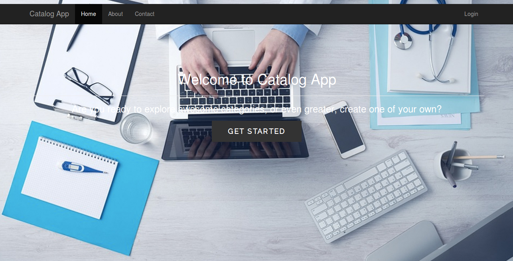

##  The homepage displays all current categories along with the latest added items.

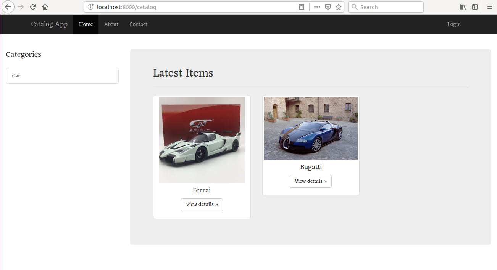

## Homepage with no items added and logged out.

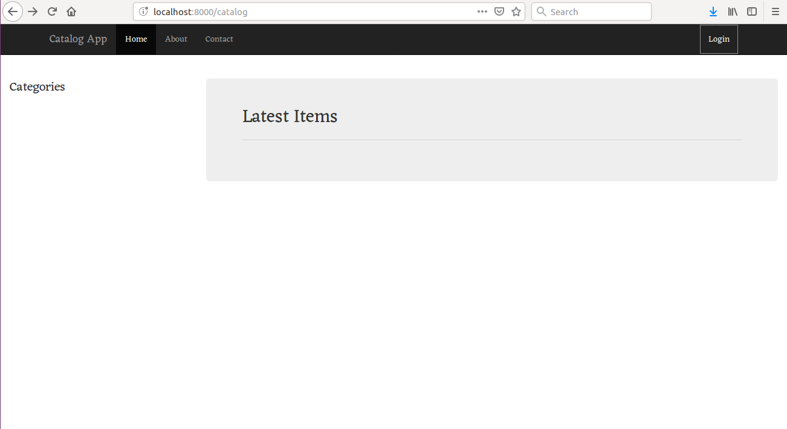

## Selecting a specific item shows you specific information of that item.

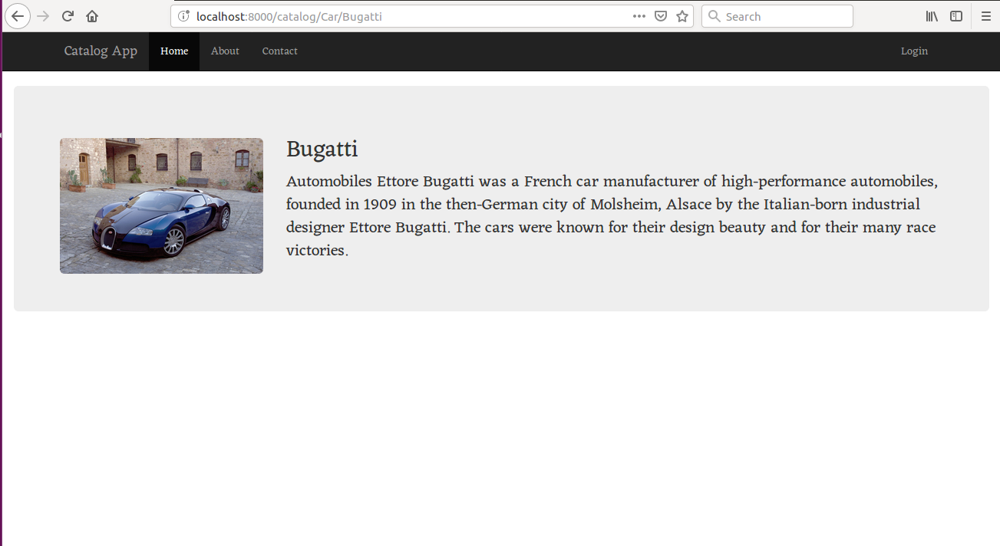

## Login Page

`/login` - login page

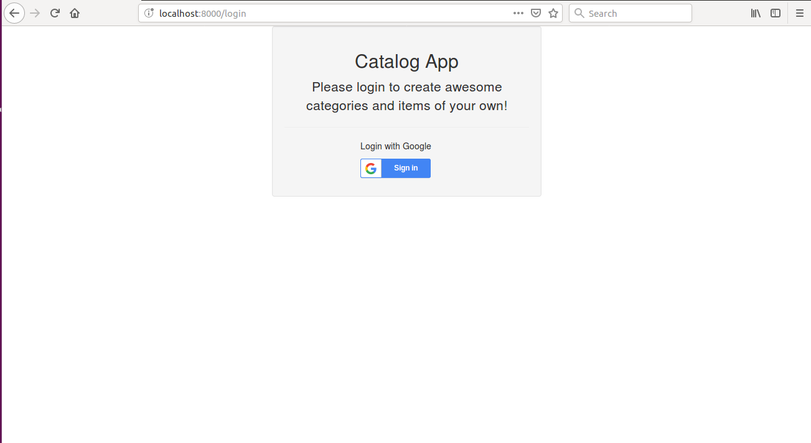

## After logging in, a user has the ability to add, update, or delete item info.

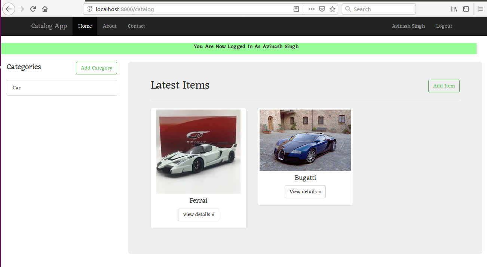

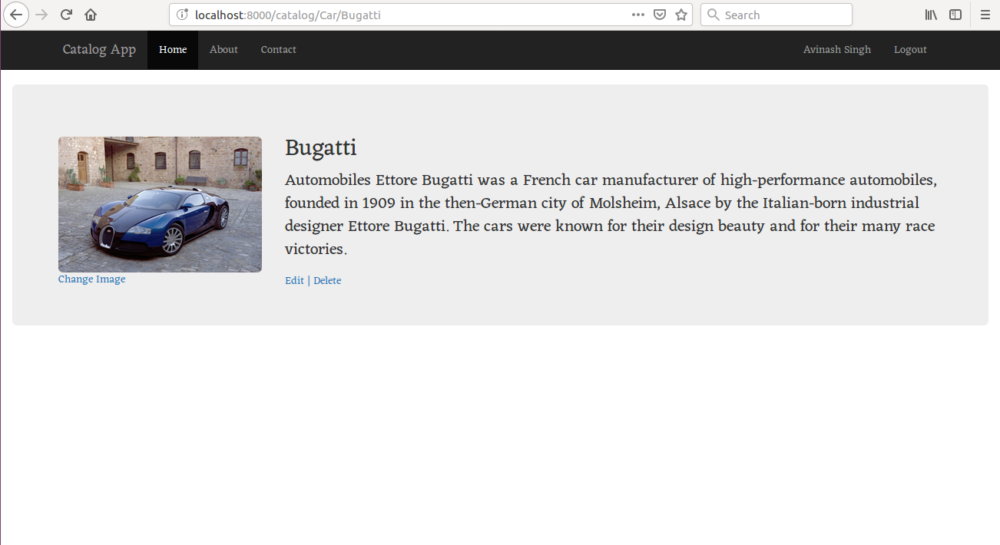

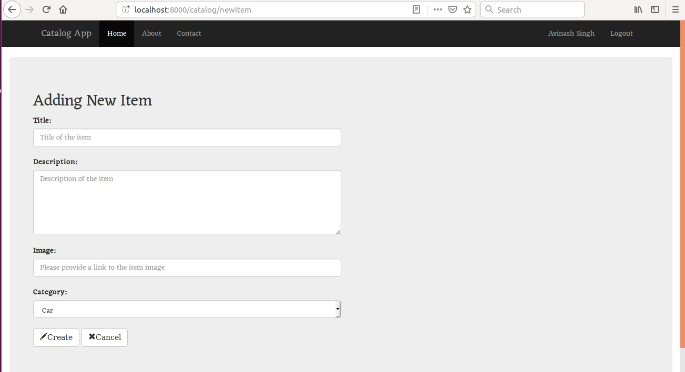

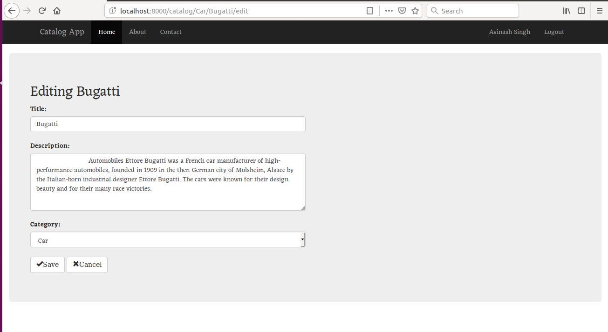

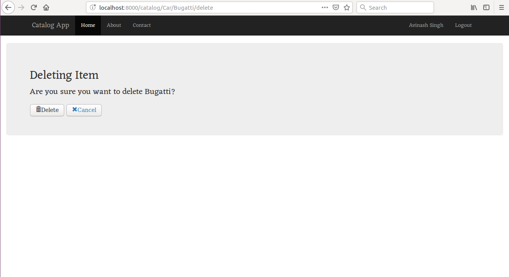

## The application provides a JSON endpoint, at the very least

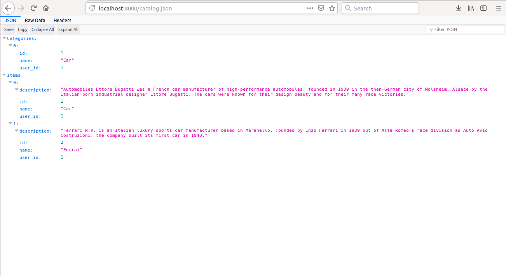

## Possible improvements

- Styling and layout could improve
- Implement CSRF protection on CRUD operations.
